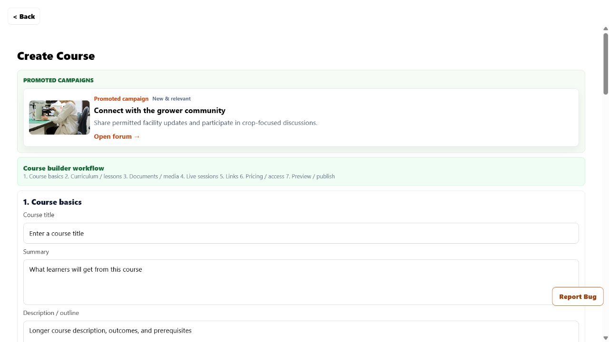
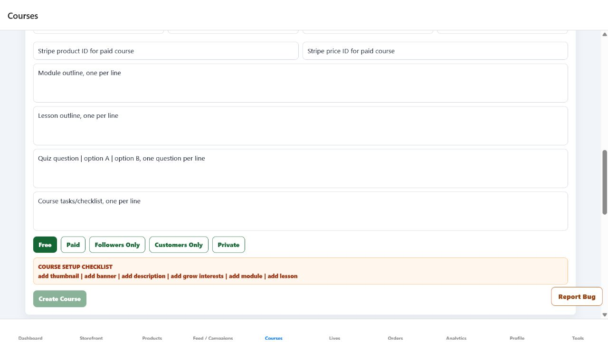
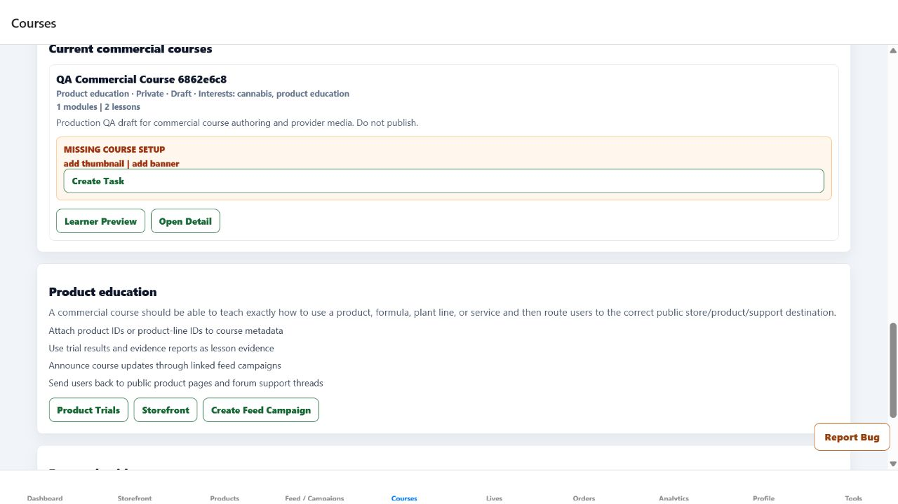

# Commercial Course Authoring Accessibility Production Evidence

Date: 2026-07-24

## Release

- Frontend PR: `#190`
- Source commit: `cec47a6a86a45e942a93e1fc529790a66d4ce333`
- Frontend merge SHA: `4244afc592bf6655c2bbfd3c6902540b18132cc5`
- Production URL: `https://growpathai.com`
- Production behavior live by: `2026-07-24T02:17:08-04:00`
- Deployment trigger: automatic deployment from `main`

The Browser's security policy continued to block access to the Render dashboard. No
Render deployment ID or Render status is claimed. Production delivery is evidenced
by the signed-in live application changing from the old heading, Back-action, radio,
and metadata behavior to the behavior introduced by merge
`4244afc592bf6655c2bbfd3c6902540b18132cc5`.

## Account and routes

- Account: `jcindc2003@yahoo.com`
- Workspace: Commercial
- Full builder:
  `https://growpathai.com/courses/create?from=%2Fhome%2Fcommercial%2Fcourses&release=4244afc592bf6655c2bbfd3c6902540b18132cc5&verify=commercial-course-builder-accessibility&poll=2`
- Commercial Courses:
  `https://growpathai.com/home/commercial/courses?release=4244afc592bf6655c2bbfd3c6902540b18132cc5&verify=commercial-course-labels`
- Live retest timestamp: `2026-07-24T02:17:08-04:00`

## Findings

- The full builder exposed eight level-one headings: the page title and all seven
  numbered workflow sections.
- The routed screen exposed both the shared Back action and a second in-page
  `Back to Courses` action.
- Free/Paid pricing used radio roles without a checked state.
- The Commercial quick form exposed access choices as generic buttons with lower-case
  stored values and no selected state.
- Existing course metadata rendered raw values such as
  `product_education | private | draft`.

## Fix

- The full builder now has one level-one page heading and seven ordered level-two
  workflow headings.
- The routed builder uses one shared Back action; the component can retain its own
  Back action only when used outside that route.
- Full-builder pricing and Commercial quick-form access are named radio groups with
  an exposed checked state.
- Access choices now display `Free`, `Paid`, `Followers only`, `Customers only`, and
  `Private`.
- The quick-form default and existing course cards use readable course labels, while
  preserving stored API values when displaying older records.
- The course workflow method and app-readable method registry now preserve these
  semantics.

## Verification

- Focused local verification passed: 3 suites, 39 tests.
- Strict targeted ESLint and `git diff --check` passed.
- The full TypeScript scan still reports known unrelated baseline failures. After the
  course prop correction, it reports no error in a file changed by PR `#190`.
- GitHub Frontend CI run `30071405520` passed in 3 minutes 28 seconds.
- PR `#190` merged only after the repository check passed.
- The signed-in production Browser retest confirmed:
  - full builder: 1 level-one heading and 7 level-two headings;
  - full builder: 1 Back button;
  - full builder: `Make course free` reported checked;
  - Commercial Courses: a named `Commercial course access` radio group;
  - Commercial Courses: Free reported checked, with readable Followers and Customers
    labels;
  - existing QA draft metadata rendered
    `Product education · Private · Draft`;
  - no raw `product_education | private | draft` metadata remained.
- No course was created, changed, published, or deleted.

Evidence types completed: focused automated tests, full GitHub CI, signed-in
production in-app Browser DOM inspection tied to the exact merge SHA and URLs, and
three genuine production Browser screenshots.

## Remaining Commercial course work

The existing private QA draft still intentionally says `Do not publish` and lacks a
thumbnail and banner. Owner-approved course content, media, rights and availability
review, accessibility fallbacks, price and Stripe setup, publish readiness, public
storefront handoff, enrollment, refund/dispute state, analytics, and intentional QA
draft cleanup remain open. None can be inferred from this accessibility slice.
