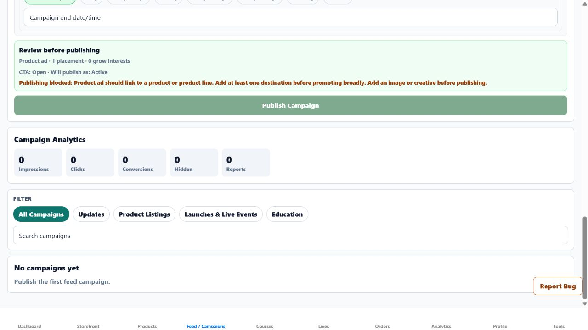

# Commercial Feed Draft-Semantics Production Evidence

Date: 2026-07-24

## Release

- Frontend PR: `#188`
- Source commit: `0c831860f395a6fc8ace27eece1472c51d0fc332`
- Frontend merge SHA: `91125db7a10efadebe94723586c533241c111ab5`
- Production URL: `https://growpathai.com`
- Production behavior live by: `2026-07-24T01:54:46-04:00`
- Deployment trigger: automatic deployment from `main`

The Browser's security policy blocked access to the Render dashboard during this
slice. No Render deployment ID or Render status is claimed. Production delivery is
instead evidenced by the signed-in live application serving behavior that exists in
merge `91125db7a10efadebe94723586c533241c111ab5` and did not exist in the preceding
release.

## Account and route

- Account: `jcindc2003@yahoo.com`
- Workspace: Commercial
- Route:
  `https://growpathai.com/home/commercial/feed?release=91125db7a10efadebe94723586c533241c111ab5&verify=commercial-feed-draft-semantics&poll=2`
- Live retest timestamp: `2026-07-24T01:54:46-04:00`

## Finding

The zero-campaign authoring review described a blocked, unpublished draft as
`Status: active`. The campaign filters also rendered raw API values (`all`,
`update`, `listing`, `drop`, and `education`) as user-facing labels and accessible
names.

## Fix

- The review now describes the planned result as `Will publish as: Active` or
  `Will publish as: Scheduled`; it does not claim that the current draft is active.
- Campaign filters now display `All campaigns`, `Updates`, `Product listings`,
  `Launches & live events`, and `Education`.
- The accessible filter names use the same user-facing labels.
- The Commercial workflow method and app-readable method registry now prohibit
  describing blocked or unpublished drafts as active and prohibit raw campaign type
  values as filter labels.

## Verification

- Focused local verification passed: 3 suites, 16 tests.
- Strict targeted ESLint and `git diff --check` passed.
- GitHub Frontend CI run `30070372681` passed in 3 minutes 16 seconds.
- PR `#188` merged only after the repository check passed.
- The signed-in production Browser retest confirmed:
  - one `Feed / Campaigns` level-one heading;
  - `CTA: Open · Will publish as: Active`;
  - no `Status: active`;
  - all five user-facing filter labels and accessible names;
  - the publish button remained disabled while the truthful setup blockers were
    present;
  - the account still reported `No campaigns yet`.
- No campaign was created, published, or otherwise added to the unlaunched
  Commercial account.

Evidence types completed: focused automated tests, full GitHub CI, signed-in
production in-app Browser DOM inspection tied to the exact merge SHA and URL, and a
genuine production Browser screenshot.

## Remaining Commercial work

Real brand and campaign destinations, owner-approved campaign creative and copy,
intentional campaign publication, public-user handoff, event persistence, analytics,
and removal or cleanup remain open. These inputs must not be invented.
