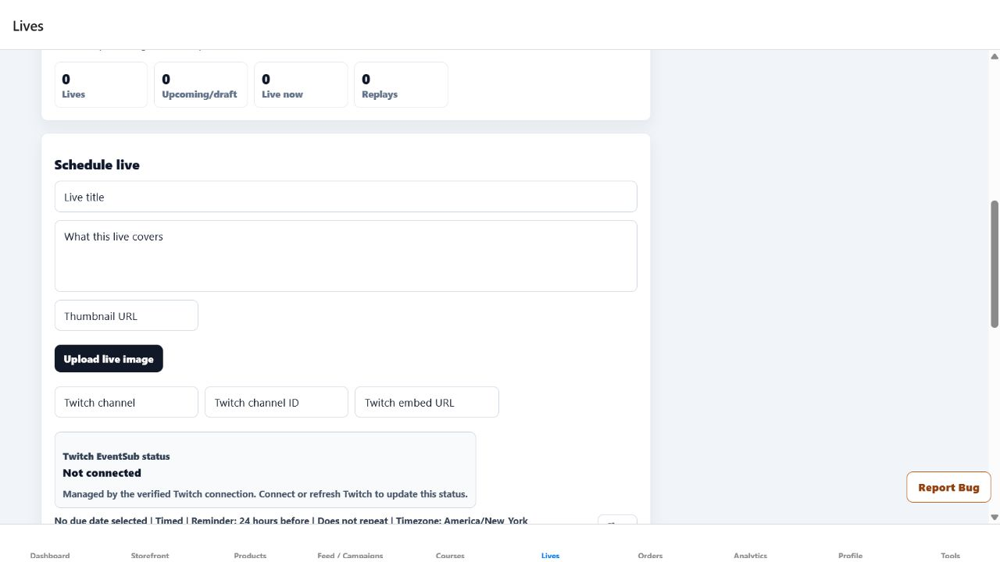
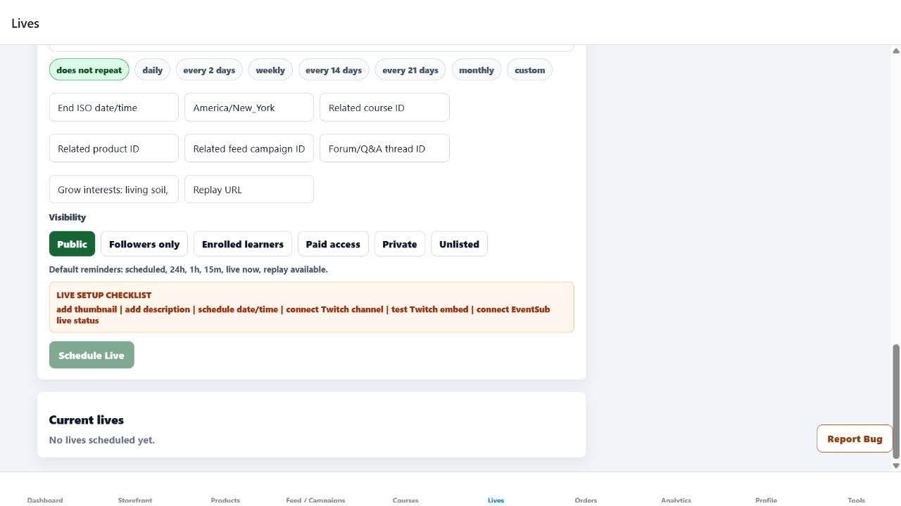

# Commercial Lives Integration-Semantics Production Evidence

Date: 2026-07-24

## Release

- Frontend PR: `#192`
- Source commit: `daf10615f9e60dc9c861b33f1207f038d960c9d9`
- Frontend merge SHA: `4b374c25e8fef0032548d08d68d003aae93dcae2`
- Production URL: `https://growpathai.com`
- Production behavior live by: `2026-07-24T02:33:01-04:00`
- Deployment trigger: automatic deployment from `main`

The Browser's security policy continued to block access to the Render dashboard. No
Render deployment ID or Render status is claimed. Production delivery is evidenced
by the signed-in application changing from the editable EventSub/raw-visibility UI
to the behavior introduced by merge
`4b374c25e8fef0032548d08d68d003aae93dcae2`.

## Account and route

- Account: `jcindc2003@yahoo.com`
- Workspace: Commercial
- Route:
  `https://growpathai.com/home/commercial/lives?release=4b374c25e8fef0032548d08d68d003aae93dcae2&verify=commercial-lives-integration-semantics&poll=2`
- Live retest timestamp: `2026-07-24T02:33:01-04:00`

## Findings

- EventSub status was an editable textbox. An author could type `connected` without a
  verified Twitch connection and satisfy that part of the live readiness check.
- The six visibility choices were generic lower-case buttons with no checked state.
- Existing live status, visibility, and EventSub metadata used raw stored values.

## Fix

- EventSub status is now read-only, connection-derived state with clear guidance to
  connect or refresh Twitch.
- Visibility is a named single-choice group with readable labels and an exposed
  checked state.
- Twitch, EventSub, live-status, and visibility metadata use readable labels.
- Grow interests are normalized before the readiness check, resolving the prior
  TypeScript error in the Lives route.
- The Commercial workflow method and app-readable method registry now prohibit
  manually authored connected status and unselected raw visibility controls.

## Verification

- Focused local verification passed: 2 suites, 32 tests.
- The focused Lives suite passed again: 3 tests.
- Strict targeted ESLint and `git diff --check` passed.
- The full TypeScript scan still reports known unrelated baseline failures, but the
  prior `src/app/home/commercial/lives.tsx` error is resolved.
- GitHub Frontend CI run `30072260129` passed in 3 minutes 3 seconds.
- PR `#192` merged only after the repository check passed.
- The signed-in production Browser retest confirmed:
  - no EventSub status textbox;
  - `Not connected` plus verified-connection guidance;
  - a named `Commercial live visibility` radio group;
  - Public reported checked;
  - `Followers only`, `Enrolled learners`, `Paid access`, `Private`, and `Unlisted`
    labels;
  - no raw `Set commercial live visibility public` button;
  - `No lives scheduled yet`.
- No Twitch connection or live record was created, changed, scheduled, or deleted.

Evidence types completed: focused automated tests, full GitHub CI, signed-in
production in-app Browser DOM inspection tied to the exact merge SHA and URL, and
two genuine production Browser screenshots.

## Remaining Commercial Lives work

Production Twitch OAuth configuration and connection, EventSub delivery, real
schedule/reminder creation, public live discovery, RSVP and notification behavior,
live/online/offline transitions, replay state, linked course/product/campaign/Forum
handoffs, analytics, and cleanup remain open. These require external configuration
and intentional owner content; they were not inferred or fabricated.
